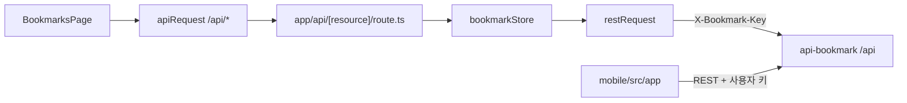
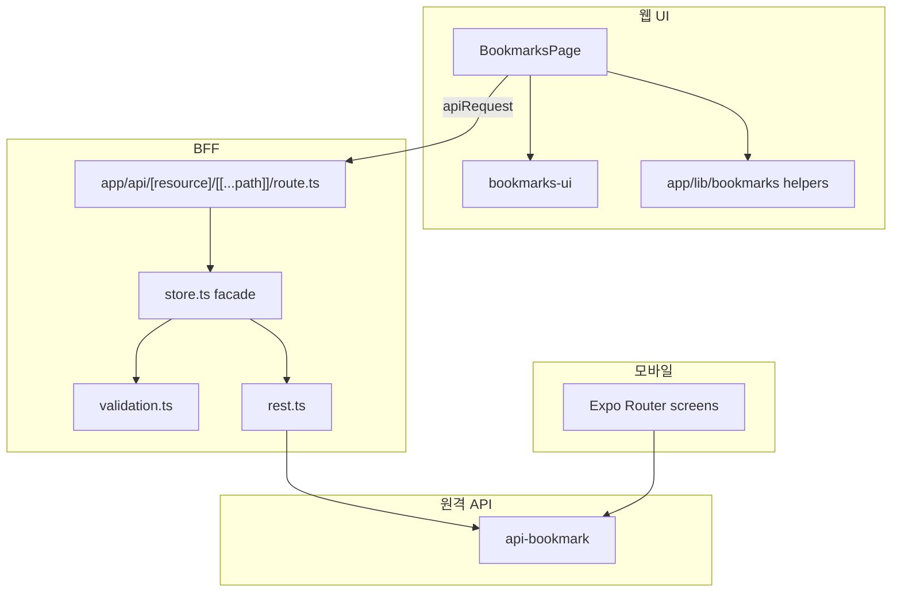

# Graphify 지식 그래프

이 저장소는 [Graphify](https://github.com/Graphify-Labs/graphify)로 코드 구조 그래프를 유지한다.
질의 가능한 산출물은 `graphify-out/`에 있다. AST 캐시(`graphify-out/cache/`)는 커밋하지 않는다.

추출 기준 커밋은 `graphify-out/GRAPH_REPORT.md`의 Graph Freshness를 본다.
코드 전용 추출이라 커뮤니티 이름은 `Community N`이다. 아래 표가 실제 모듈 매핑이다.

웹·모바일은 한 모노레포이지만 런타임은 분리되어 있다. 그래프는 둘 다 포함한다.

## 산출물

| 파일 | 용도 |
| --- | --- |
| `graphify-out/GRAPH_REPORT.md` | 커뮤니티·허브·고드 노드 요약 |
| `graphify-out/graph.json` | `query` / `path` / `explain` 원본 |
| `graphify-out/graph.html` | 인터랙티브 그래프 |
| `graphify-out/GRAPH_TREE.html` | 파일 트리 뷰 |
| `graphify-out/bookmark-callflow.html` | 호출 흐름 |

현재 스냅샷: **566 nodes · 1028 edges · 46 communities**. 순환 import 없음. 웹 추출은 거의 전부 EXTRACTED.

## 워크스페이스

형제 저장소 `api-bookmark`와 런타임으로만 연결된다. 그래프를 합치려면:

```bash
graphify merge-graphs \
  ../api-bookmark/graphify-out/graph.json \
  graphify-out/graph.json \
  --out /tmp/workspace-merged-graph.json
```



브라우저는 API 비밀을 보지 않는다. 모바일 키를 웹 서버 env에 복사하지 않는다.

## 레이어



## 커뮤니티 해석

| ID | 실제 의미 | 대표 심볼·파일 |
| --- | --- | --- |
| C1 | 대시보드 페이지 상태 | `BookmarksPage()`, `dropBookmark()`, `saveFolder()` in `app/(dashboard)/page.tsx` |
| C0 | 추출 UI + 초안 타입 | `bookmarks-ui/*`, `FolderTreeRow`, `BookmarkDialog` |
| C4 | 카드·URL·shadcn | `BookmarkCard`, `Favicon`, `safeUrl()`, `badgeVariants` |
| C8 | BFF REST 전송 | `restRequest()`, `store.ts` |
| C11 | BFF HTTP 라우트 | `GET`/`POST`/`PATCH`/`DELETE` in `app/api/[resource]/[[...path]]/route.ts` |
| C15 | 파비콘 프록시 | `app/api/favicon/route.ts` |
| C3 | Expo 화면 | `mobile/src/app/{index,add,settings}.tsx` |
| C6 | 토스트·서비스워커 | `app/components/toast.tsx`, `ServiceWorkerRegistration` |
| C10 | 릴리스 스크립트 | `die()`, `doctor()`, `release.sh` |
| C2 / C5 / C7 / C9 / C12–C16 | 패키지·tsconfig·Expo 설정 | `package.json`, `app.json`, `components.json` |

고드 노드: `cn()`(37), `BookmarksPage()`(30), `expo`, `folderParentId()`, `BookmarkItem`.
`cn()`과 설정 JSON이 허브인 것은 UI/툴링 그래프의 특성이다. 도메인 허브는 `BookmarksPage`다.

`BookmarksPage`가 여전히 상태·핸들러 허브다. 다음 추출 후보는 `useBookmarksPage` 훅이다.
`export default function BookmarksPage` 문자열은 테스트가 고정하므로 유지한다.

## 그래프가 놓치는 런타임 엣지

페이지는 `bookmarkStore`를 import하지 않는다. `apiRequest`로 same-origin BFF를 호출하고, BFF만 스토어를 쓴다.

| 질의 | 결과 | 해석 |
| --- | --- | --- |
| `path BookmarksPage bookmarkStore` | directed 없음 | 런타임은 `page → apiRequest → /api/* → bookmarkStore` |
| `path BookmarksPage restRequest --undirected` | 간접 경로 | `page → apiRequest → /api/* → bookmarkStore → restRequest` 런타임 경로를 문서와 함께 해석한다 |
| `path GET restRequest` | directed 없음일 수 있음 | `route.ts`는 `bookmarkStore`를 호출하고, 스토어가 `restRequest`를 호출한다 |
| `explain restRequest` | `store.ts`가 import | REST 전송 계층 입구 |
| `query "how does the BFF route call REST"` | C11 + C8 | 라우트 가드와 `restRequest`가 같은 질문에 붙는다 |

183개 isolated 노드(`BookmarkDialog` 등)는 타입·초안 객체가 호출 엣지 없이 모인 것이다. 누락된 기능이 아니다.

## 자주 쓰는 질의

```bash
graphify query "how does the BFF route call REST"
graphify explain "BookmarksPage"
graphify explain "restRequest"
graphify god-nodes
graphify path "BookmarksPage" "restRequest" --undirected
graphify affected "BookmarksPage"
```

## 갱신

```bash
graphify update .
graphify update . --force
```

시맨틱 커뮤니티 이름이 필요하면 API 키를 넣고 `graphify extract .` 또는 `graphify label .`를 실행한다.
